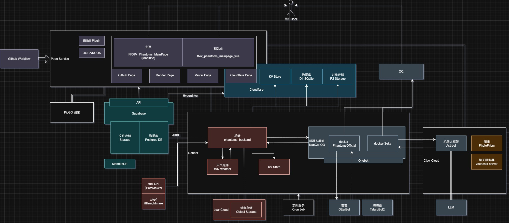

# phantoms-backend
_phantoms Java backend_


## 主要功能:
- **特性**
    - D1 / LeanCloud 相关交互
    - Supabase 相关交互
    - 操作 主数据源(PostgreSQL) 备份数据源(MySQL)
    - 操作 Redis 缓存(Render)
    - 发送电子邮件
    - 对接 Littlenightmare API
    - 对接 FFXIV API
    - 对接 石之家 API
    - 操作 NapCat QQ
    - 图片代理服务器(由于内存开销巨大,现已弃用)

- **流程**
    - **`在线聊天室`**:通过 NapCat QQ 进行消息转发
    - **`获取招募信息`**:从Littlenightmare获取招募信息,存储数据库,对特定招募发送群提醒
         (由于云端发送请求会触发Cloudflare图灵检测,代理服务器流量有限,现已停用)
    - **`不活跃提醒`**:从石之家获取数据,检查用户离线天数,对30~45天未上线的拥有房屋的用户发送提醒
    - **`定时备份`**:定时将主数据源(PostgreSQL)的数据备份到备份数据源(MySQL)
    - **`健康检查`**:生成健康检查日志
    - **`邮件操作接口`**:通过SMTP发送电子邮件
    - **`前端接口`**:支持前端有关XIVAPI/石之家/数据库查询等相关请求

## 系统架构图:


## 开发备注:
PS:由于Github的lfs存储空间有限，所以每次提交代码不保留旧版本文件
### 自动清理本地 LFS 文件

需要配置本地项目路径下的.git/hooks/post-commit文件,手动添加下列代码:

```
# 自动运行 git lfs prune
echo "Running git lfs prune to clean up old LFS files..."
git lfs prune
```

也可以执行根目录下的setup-hooks脚本来还原备份文件

备份文件:[post-commit](post-commit)

setup-hooks.sh:
```Bash
#!/bin/bash

# 检查是否在 Git 仓库中
if [ ! -d ".git" ]; then
  echo "This script must be run in a Git repository."
  exit 1
fi
# 复制 post-commit 钩子
cp post-commit .git/hooks/post-commit
chmod +x .git/hooks/post-commit

echo "Git hooks have been set up successfully."
```

手动执行`git lfs prune`命令也可以清理旧的LFS文件。

### 手动清理远程仓库中的 LFS 文件
GitHub 提供了一个工具 git lfs migrate，可以帮助清理远程仓库中的旧版本 LFS 文件。

#### 1.安装 git-lfs 工具
`git lfs install`

#### 2.使用 git lfs migrate 清理远程仓库

git lfs migrate 可以帮助你将旧版本的 LFS 文件从远程仓库中移除：

`git lfs migrate import --include="*.jar" --include-ref=refs/heads/main`

这个命令会将所有 .jar 文件的旧版本从远程仓库中移除，并只保留最新的版本。

#### 3.推送更改到远程仓库
运行以下命令将更改推送到远程仓库：

`git push origin main --force`

#### 4.自动化脚本
```Bash
#!/bin/bash

# 拉取最新更改
git pull origin main
# 运行 git lfs migrate 命令
git lfs migrate import --include="*.jar" --include-ref=refs/heads/main
# 推送更改到远程仓库
git push origin main --force
```

