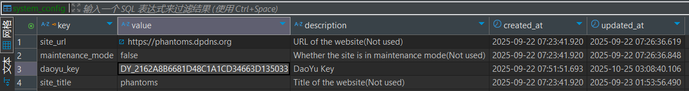

# 石之家数据获取流程说明（已过时）

## 用户ID获取

**登录地址：** https://www.daoyu8.com/#/
**认证方式：** 扫码登录


**用户信息接口：** getInfo
**认证Cookie：** cookie: USERSESSID=DY_1FCEB820ADBB414F9298EB4C91B9B12A
**获取到的daoyukey配置在数据库中：**
库表：public.system_config


直接在库表中修改值，Scheduler会每30分钟一次定时获取并更新缓存。
也可以使用以下API更新/检查配置
```
获取状态
Get /status/daoyu-key
手动检查
Post /check/daoyu-key
刷新缓存
Post /refresh/daoyu-key
切换通知配置
Post /config/daoyu-notification
```

## 石之家登录流程

### 完整登录步骤：

1. **Get Temp Cookies** → 获取临时Cookie
2. **Initialize Login Flow** → 初始化登录流程，获取flowId
3. **Query Account List** → 查询账号列表
4. **Make Confirm** → 选择账号并进行服务器鉴权
5. **Get Sub Account Key** → 获取子账号的daoyu_ticket
6. **Dao Login** → 使用daoyu_ticket登录石之家
7. **Do Login** → 验证登录状态，获取最终的登录Cookie

## 数据更新说明
**石之家数据更新时间：** 中午12点更新截止至前一天22:00的数据

## 注意事项
- 登录过程中需要保持网络连接稳定
- Cookie有效期后需要重新获取